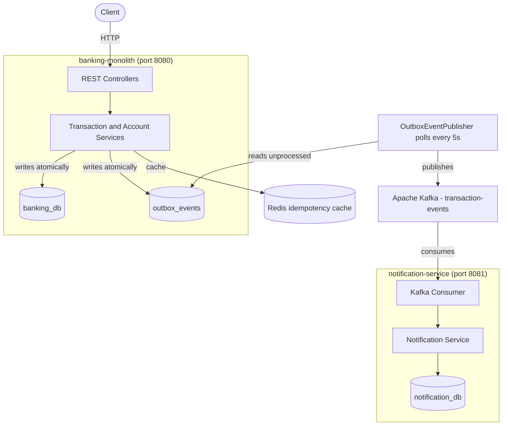

# Banking System

A microservices-based banking application built with Spring Boot, focused on demonstrating production-grade patterns: idempotency, optimistic locking, event-driven communication, and atomic event publishing via the Outbox pattern.

> ️ **Educational project, in active development.** Built to learn distributed systems concepts hands-on. Not intended for production use.

>  **Development history.** The monolith was originally developed in a separate repository ([banking-monolith](https://github.com/mariozcn/banking-monolith)) during the initial learning phase. When the system grew to include a second service communicating via Kafka, both were migrated into this monorepo for unified development and orchestration. The original repo is preserved as a record of the incremental commit history.

---

## Architecture



The system is organized as a **monorepo** with two independent Spring Boot services communicating asynchronously via Kafka. Each service owns its database — no shared schemas.

---

## Tech Stack

**Backend:** Java 21, Spring Boot 3, Spring Data JPA, Hibernate
**Databases:** MySQL 8 (per-service schemas), Redis (caching)
**Messaging:** Apache Kafka, Zookeeper
**Migrations:** Flyway
**Build & Deploy:** Maven, Docker, Docker Compose
**Testing:** JUnit 5, Mockito, Testcontainers (real MySQL + Redis in tests)
**API Docs:** OpenAPI / Swagger UI

---

## Key Features

### Idempotency keys (Redis-backed)
Clients send an `Idempotency-Key` header on every transfer request. The first request executes and the response is cached in Redis for 24 hours. Retries with the same key return the cached response instead of re-executing — guaranteeing exactly-once semantics for transfers even under network failures or client retries.

### Optimistic locking on accounts
Each `Account` has a `@Version` field managed by Hibernate. Concurrent transfers touching the same account are detected at the database level (`UPDATE ... WHERE id = ? AND version = ?`) and one of them fails cleanly — preventing lost updates on balances.

### Outbox Pattern (atomic DB + Kafka)
Instead of publishing events directly to Kafka (which can fail independently of the database transaction), every event is first persisted to an `outbox_events` table **within the same transaction** as the business write. A background `@Scheduled` publisher polls the outbox every 5 seconds, publishes to Kafka, and marks events as processed. This guarantees that **no event is ever published without a corresponding committed transaction**, and conversely no transaction commits without its event being eventually published.

### Event-driven microservice extraction
`notification-service` was extracted from the monolith and now consumes `transaction-events` from Kafka. The two services share **no code and no database** — only the message contract. The monolith doesn't know `notification-service` exists; adding more consumers in the future would require zero changes to the monolith.

### Audit log
Every transfer is recorded in an append-only `audit_log` table — including failed attempts — for traceability and debugging.

### Integration testing with Testcontainers
Tests run against **real MySQL and Redis containers** instead of H2 in-memory substitutes. Catches issues that only appear with the actual database (constraint behavior, JSON columns, dialect-specific SQL).

---

## Running locally

Requires Docker Desktop.

Clone the repo and start everything (MySQL, Redis, Kafka, Zookeeper, both services):

```bash
git clone https://github.com/mariozcn/banking-system.git
cd banking-system
cp .env.example .env
docker compose up -d --build
```

Wait around 30 seconds for all services to start, then open Swagger UI:

- Monolith: `http://localhost:8080/swagger-ui/index.html`
- Notification service: `http://localhost:8081/swagger-ui/index.html` (if exposed)

Both services pick up environment variables from `.env`. The notification service's database (`notification_db`) is auto-created via Flyway migrations on first start.

---

## Example: making a transfer

**Step 1 — create two accounts:**

```bash
curl -X POST http://localhost:8080/api/v1/accounts \
  -H "Content-Type: application/json" \
  -d '{"ownerName": "Ion Popescu", "currency": "RON"}'

curl -X POST http://localhost:8080/api/v1/accounts \
  -H "Content-Type: application/json" \
  -d '{"ownerName": "Maria Ionescu", "currency": "RON"}'
```

**Step 2 — top up the sender's account directly in MySQL** (no deposit endpoint yet):

```sql
UPDATE accounts SET balance = 1000 WHERE account_number = 'ACC...';
```

**Step 3 — transfer 50 RON from Ion to Maria:**

```bash
curl -X POST http://localhost:8080/api/v1/transactions \
  -H "Content-Type: application/json" \
  -H "Idempotency-Key: 550e8400-e29b-41d4-a716-446655440000" \
  -d '{
    "sender": "ACC...",
    "receiver": "ACC...",
    "amount": 50,
    "currency": "RON"
  }'
```

Maria receives a notification, which is persisted in `notification_db.notifications`.

---

## Project structure

```
banking-system/
├── banking-monolith/
│   ├── src/
│   ├── Dockerfile
│   └── pom.xml
├── notification-service/
│   ├── src/
│   ├── Dockerfile
│   └── pom.xml
├── docker-compose.yml
├── .env
└── README.md
```

---

## Design decisions

**Why start with a monolith and then extract?**
Starting monolithic kept feedback loops fast while learning the domain. Once the boundaries became clear (notification logic is async, one-way, no inverse dependencies), extracting it into its own service was a small, mechanical change rather than a redesign.

**Why MySQL over PostgreSQL?**
Personal familiarity from previous projects. PostgreSQL would be the more conventional choice in banking, particularly for its stricter type system and JSON support, and the schema could be ported with small changes.

**Why Kafka over REST for service-to-service communication?**
Decoupling and resilience. With REST, the monolith would need to know about and wait for the notification service. With Kafka, the monolith publishes and forgets; if the notification service is down, transfers still succeed and events queue up for later processing.

---

## What's next

- Split account and transaction logic into separate services
- Add deposit and withdraw endpoints (currently balances are seeded directly in SQL)
- Add a user/authentication layer with Spring Security and JWT
- Add more integration test coverage on the outbox publisher and consumer
- Improve error handling and standardize HTTP error responses

---

## Author

**Mario-Antonio Rusu** — 2nd-year Automation & Applied Informatics student at UTCN Cluj-Napoca.
[LinkedIn](https://linkedin.com/in/mariorusu72) · [GitHub](https://github.com/mariozcn)